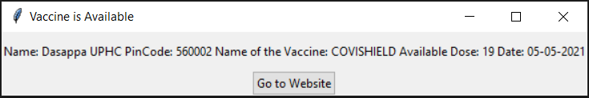

# VaccineAlert

Code will give you a pop-up when the vaccine is available in your area. 
Make sure that script should run continuously in background  
Tested in windows  

## How to run this code ?
Download code folder from repository 
In this python code, when slot available it will give you sound alert too.

### Install basic library needed to run this code
- Step 1: Open terminal in the present working directory
- Step 2: Go to code folder [where requirements.txt file present]
- Step 2: Run following command:  "pip install -r requirements.txt"

### Finally run code
- Double click on "code.py". or run "code.py"
- Give proper input of pincode and age. Put it in a backgroud
- Don't close running programm
- Now do your other work, Pop-up shown below image will come to your screen when the vaccine

##### References: 
https://apisetu.gov.in/public/marketplace/api/cowin
